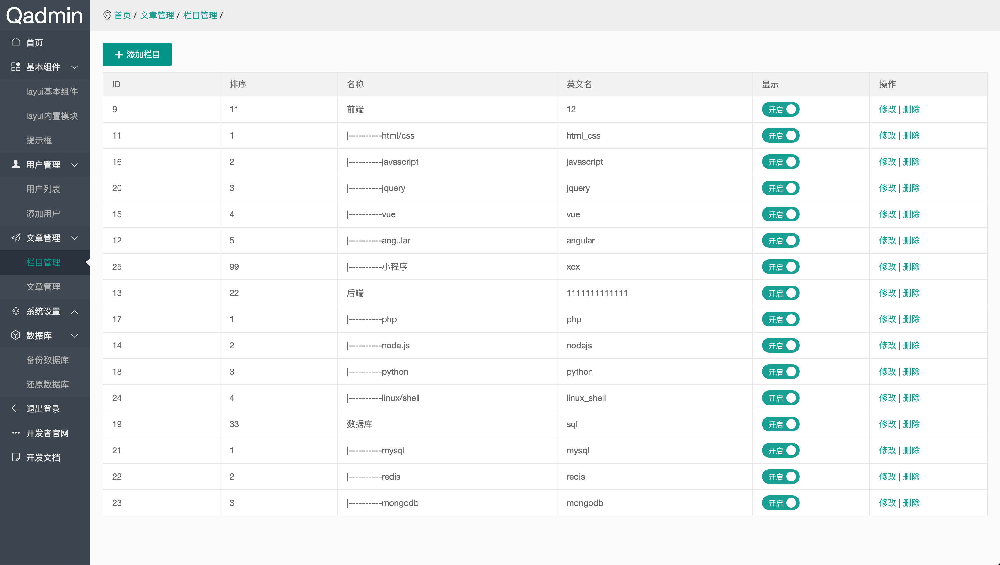

# QAdmin轻量级后台模板

基于[layui框架](https://github.com/sentsin/layui)与[Vue.js](https://cn.vuejs.org/)构建

轻量不复杂 简洁不简单





### git仓库

- github: [https://github.com/aa24615/qadmin](https://github.com/aa24615/qadmin)
- gitosc: [https://gitee.com/flash127/qadmin](https://gitee.com/flash127/qadmin)


### 目录结构

```
 ├─dist                           构建后的代码
    ├─qadmin-html                 经典版
        ├─data                    模拟数据目录
        │  ├─menu.json            左侧菜单
        │  └─ ...    
        ├─static                  静态资源            
        │  ├─admin                后台资源目录
        │  │  ├─js                js目录
        │  │  │  ├─config.js      菜单与基本配置
        │  │  ├─css               样式目录
        │  │  ├─img               图片目录
        │  │  └─ ...      
        │  ├─layui                layui
        │  ├─ueditor              百度编辑器
        │  ├─webuploader          百度上传插件
        │  ├─js                   公共js库
        │  └─ ...      
    ├─qadmin-iframe               iframe版(文件与经典版一致)
  ├─src                           原代码(使用者不必理会)
  ├─app.js                        nodejs脚本
```


### 经典版

- 每个页面都需要引入左侧菜单与顶栏
- 左侧菜单由vue渲染
- 缺点: 跳转时能看到左侧有闪动的瞬间
- 演示: [http://demo.qadmin.net](http://demo.qadmin.net)

### iframe版

- 只需要一个页面引入左侧菜单与顶栏
- 左侧菜单由vue渲染,主体内容以iframe标签方式展示
- 优点: 传统,简单,上手更快
- 演示: [http://iframe.qadmin.net](http://iframe.qadmin.net)

### 在框架中使用

> php

- thinkphp6示例

    github: [https://github.com/aa24615/qadmin-thinkphp6](https://github.com/aa24615/qadmin-thinkphp6)  
    gitosc: [https://gitee.com/flash127/qadmin-thinkphp6](https://gitee.com/flash127/qadmin-thinkphp6)

- laravel8示例

    github: [https://github.com/aa24615/qadmin-laravel8](https://github.com/aa24615/qadmin-laravel8)    
    gitosc: [https://gitee.com/flash127/qadmin-laravel8](https://gitee.com/flash127/qadmin-laravel8)

> java

- spring示例

    github: [https://github.com/aa24615/qadmin-spring-web-mvc](https://github.com/aa24615/qadmin-spring-web-mvc)    
    gitosc: [https://gitee.com/flash127/qadmin-spring-web-mvc](https://gitee.com/flash127/qadmin-spring-web-mvc) 

> nodejs

- Express4示例

    github: [https://github.com/aa24615/qadmin-express](https://github.com/aa24615/qadmin-express)     
    gitosc: [https://gitee.com/flash127/qadmin-express](https://gitee.com/flash127/qadmin-express) 

> go

- beego示例

    ...待完善


### 参与贡献

1. fork 当前库到你的名下
2. 在你的本地修改完成审阅过后提交到你的仓库
3. 提交 PR 并描述你的修改，等待合并


### 联系我们

- QQ群: [943685402](https://qm.qq.com/cgi-bin/qm/qr?k=Fg-zh0M3VrrxNfMs9RxsEyfGa6OqCGCF&jump_from=webapi)


### License

qadmin is licensed under the license of MIT. See the [LICENSE](LICENSE) for more details.


